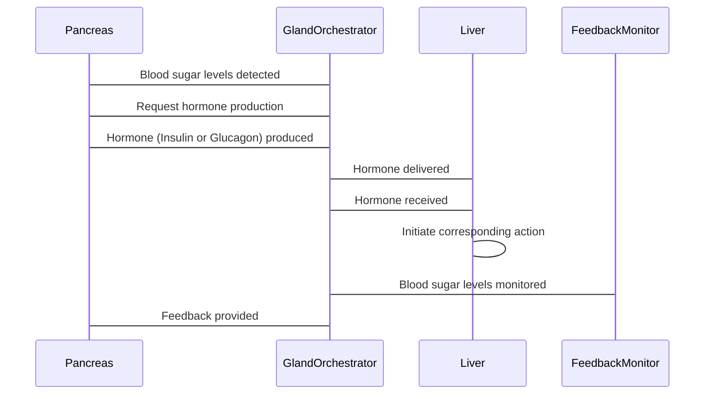
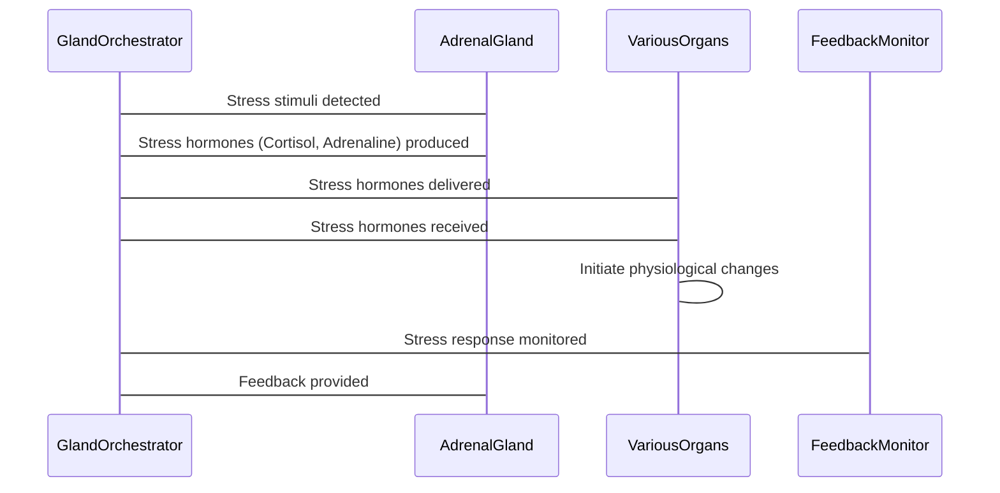
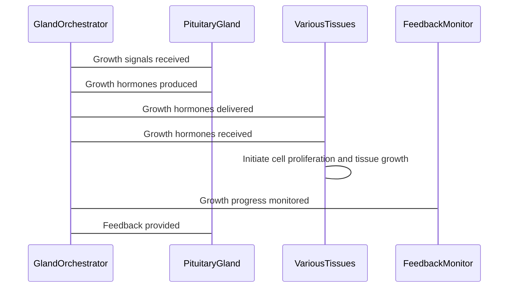
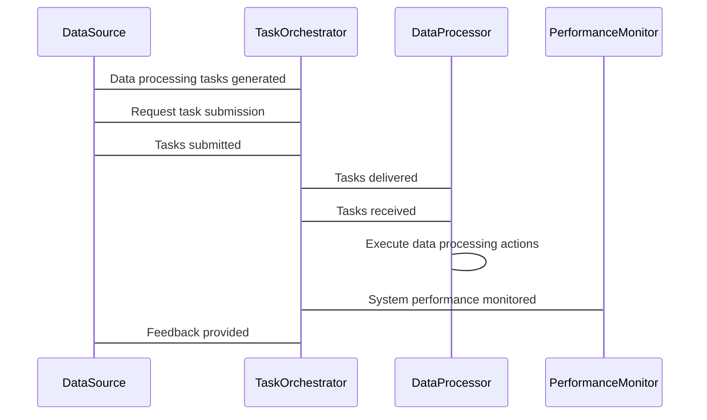
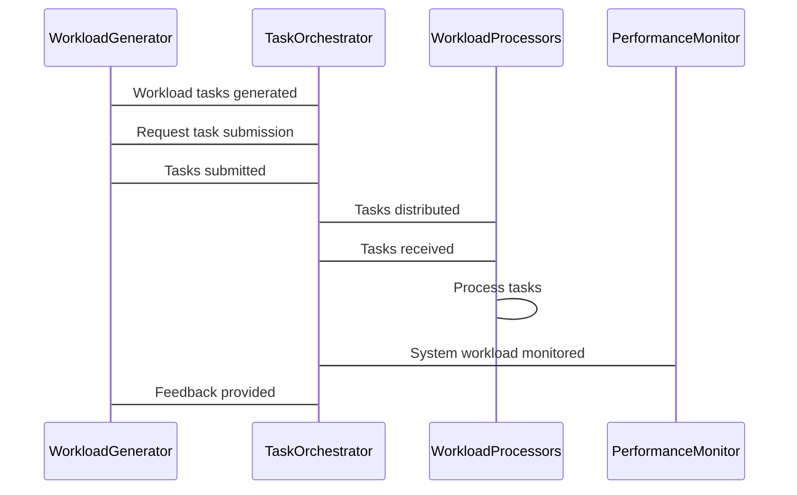
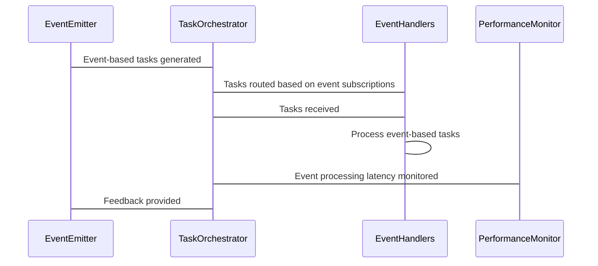
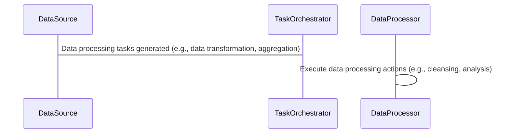
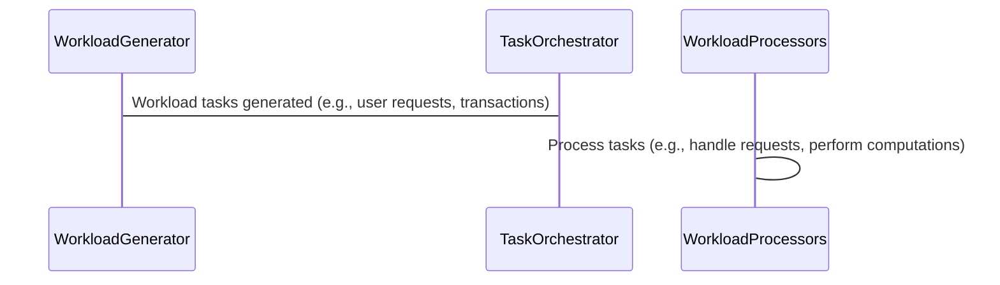
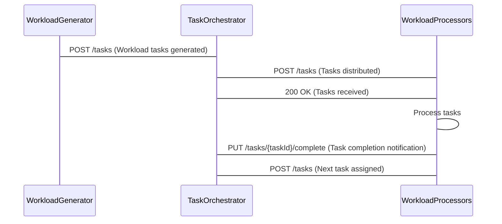
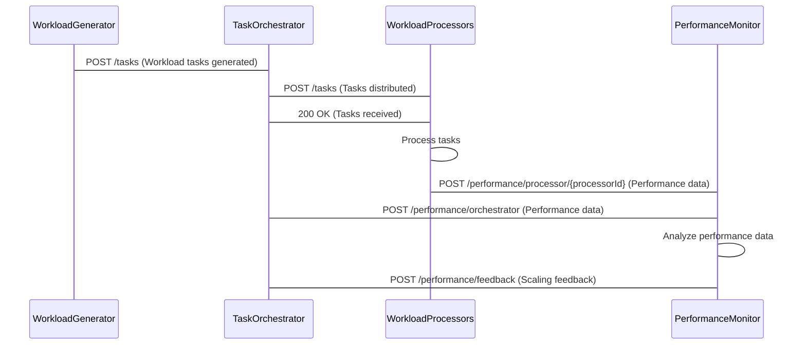

---
geometry:
- margin=1cm
---

# I would like your help designing a software (SW) application.

https://claude.ai/chat/dd435086-e1cd-4b7f-88b3-8cbbce4c79a6

---

## The app should be a distributed execution system using a microservice architecture.

> Please provide 3 potential designs. Please describe the systems and their interactions as a Systems Theory expert might describe them. Also, please provide a metaphor or analogy for each to help me understand them.

Certainly! Here are three potential designs for a distributed execution system using a microservice architecture, along with systems theory explanations and analogies:

### Design 1: Orchestrated Microservices
In this design, the system consists of multiple microservices, each responsible for a specific function. A central orchestrator acts as the control center, coordinating the interactions and communication between the microservices. The orchestrator receives requests from clients, determines the necessary microservices to fulfill the request, and routes the data and instructions accordingly. The microservices process their respective tasks and return the results to the orchestrator, which then aggregates the responses and sends them back to the client.

#### Systems Theory Explanation
The orchestrated microservices design follows a centralized control model. The orchestrator serves as the central authority, regulating the flow of information and control signals within the system. It maintains a global view of the system's state and directs the microservices to achieve the desired output. The microservices are subsystems that operate independently but are coordinated by the orchestrator to work towards a common goal.

#### Analogy
This design is analogous to a symphony orchestra. The orchestrator is like the conductor, guiding and coordinating the various sections (microservices) of the orchestra. Each section has its own specialized role and performs its part independently, but the conductor ensures that they work together harmoniously to create a cohesive musical piece.

### Design 2: Event-Driven Microservices
In an event-driven microservices design, the system relies on asynchronous communication through events. Each microservice publishes events related to its domain and subscribes to events it is interested in. When a microservice receives an event, it processes the associated data and may generate new events for other microservices to consume. This design enables loose coupling between microservices, allowing them to react to events independently.

#### Systems Theory Explanation
The event-driven microservices design follows a decentralized control model. Each microservice operates autonomously and reacts to events based on its own logic. The system's behavior emerges from the collective interactions and event propagation among the microservices. The loose coupling allows for flexibility and scalability, as microservices can be added or removed without affecting the entire system.

#### Analogy
This design is analogous to a social media platform. Each user (microservice) posts updates (events) about their activities and interests. Other users who follow or are interested in those topics receive the updates and can react to them by liking, commenting, or sharing (processing the event and generating new events). The overall behavior of the platform emerges from the individual actions and interactions of the users.

### Design 3: Service Mesh
In a service mesh design, the system introduces a dedicated infrastructure layer that handles cross-cutting concerns such as communication, security, and observability. Each microservice is accompanied by a sidecar proxy that intercepts and manages all incoming and outgoing network traffic. The sidecar proxies form a mesh network, enabling service discovery, load balancing, and fault tolerance. The service mesh abstracts away the complexities of inter-service communication, allowing developers to focus on business logic.

#### Systems Theory Explanation
The service mesh design follows a decentralized control model with a separate control plane. The sidecar proxies act as local controllers for each microservice, handling communication and enforcing policies. The control plane, often implemented as a separate set of services, provides a global view and management of the service mesh. The separation of concerns between the data plane (microservices) and the control plane allows for independent scaling and evolution of each layer.

#### Analogy
This design is analogous to a city's transportation network. The microservices are like the buildings (destinations) in the city, while the sidecar proxies are like the roads and intersections that connect them. The control plane acts as the traffic management system, monitoring and controlling the flow of traffic (requests) between the buildings. It ensures efficient routing, load balancing, and handles disruptions or congestion in the network.

These designs provide different approaches to building a distributed execution system using microservices, each with its own characteristics and trade-offs. The choice of design depends on the specific requirements, scalability needs, and complexity of the system being developed.

---

## Ok, now, I prefer to get my architecture and design inspirations from biology.

> Please provide the systems and their interactions from biological systems. Note, if you need some suggestions here are some biological systems:
> 
> 1. Ecosystems
> 1. Endocrine system
> 1. A cell, its components and how they interact

Certainly! Let's explore how biological systems can inspire the design of a distributed execution system using microservices. We'll look at ecosystems, the endocrine system, and a cell with its components.

1. **Ecosystem-Inspired Design**: In an ecosystem, various organisms interact with each other and their environment to form a complex network of relationships. Each organism has a specific role and contributes to the overall functioning of the ecosystem.
    - **Systems Theory Explanation**: In an ecosystem-inspired design, the microservices are analogous to different organisms in an ecosystem. Each microservice has a specific function and interacts with other microservices to achieve a common goal. The interactions between microservices are based on predefined contracts or APIs, similar to how organisms in an ecosystem interact through symbiotic relationships or food chains. The system's overall behavior emerges from the collective interactions of the microservices.
    - **Biological Analogy**: Consider a coral reef ecosystem. Each species of coral, fish, and other organisms has a specific role and contributes to the health and balance of the reef. Some species provide shelter, while others control algae growth or recycle nutrients. Similarly, in an ecosystem-inspired microservice design, each microservice performs a specific function and contributes to the overall functionality of the system.
1. **Endocrine System-Inspired Design**: The endocrine system in the human body consists of glands that secrete hormones into the bloodstream. These hormones act as messengers, regulating various bodily functions and maintaining homeostasis.
    - **Systems Theory Explanation**: In an endocrine system-inspired design, the microservices are analogous to the glands, and the communication between them is similar to hormone signaling. Each microservice produces and consumes specific messages (hormones) that trigger actions or state changes in other microservices. The messages are broadcasted through a messaging system (bloodstream), and the microservices that are subscribed to or sensitive to those messages react accordingly. This design enables loose coupling and asynchronous communication between microservices.
    - **Biological Analogy**: Consider the regulation of blood sugar levels by the pancreas and liver. When blood sugar levels rise, the pancreas secretes insulin (a message), which signals the liver and other cells to absorb glucose from the bloodstream. Conversely, when blood sugar levels drop, the pancreas secretes glucagon (another message), signaling the liver to release stored glucose. Similarly, in an endocrine system-inspired design, microservices send and receive messages to coordinate and regulate the system's behavior.
1. **Cell-Inspired Design**: A cell is the basic unit of life, consisting of various organelles that work together to maintain the cell's functions. Each organelle has a specific role and interacts with other organelles to ensure the cell's survival and growth.
    - **Systems Theory Explanation**: In a cell-inspired design, the microservices are analogous to the organelles within a cell. Each microservice has a specific responsibility and interacts with other microservices through well-defined interfaces or protocols. The interactions between microservices are orchestrated to achieve the desired functionality of the system. The system's overall behavior is a result of the coordinated actions of the individual microservices.
    - **Biological Analogy**: Consider the process of protein synthesis within a cell. The nucleus (a microservice) contains the genetic information and sends mRNA (messages) to the ribosomes (another microservice) in the cytoplasm. The ribosomes read the mRNA and assemble amino acids to form proteins. The endoplasmic reticulum (another microservice) then modifies and transports the proteins to their destination. Each organelle plays a specific role, and their interactions enable the cell to synthesize proteins effectively.

These biological systems provide inspiration for designing distributed execution systems using microservices. By understanding the principles and interactions in ecosystems, endocrine systems, and cells, we can create architectures that are resilient, adaptable, and scalable. The key is to identify the specific roles and responsibilities of each microservice, define clear communication protocols, and ensure that the interactions between microservices lead to the desired system behavior.

---

## Ok, lets begin to add detail to the endocrine system-inspired design.

> Please enumerate and detail 3-5 microservices that need to be implemented. Then please detail 3-5 use cases and explain them via systems theory and detail the communication between the microservices using sequence diagrams.

Certainly! Let's dive into the endocrine system-inspired design and detail the microservices, use cases, and their interactions.

### Microservices

- **HormoneProducer**: Responsible for producing and secreting hormones (messages) based on specific triggers or stimuli.
- **HormoneReceptor**: Receives and processes hormones (messages) from the HormoneProducer and initiates appropriate actions or state changes.
- **GlandOrchestrator**: Coordinates the interactions between HormoneProducers and HormoneReceptors, ensuring proper message routing and orchestration.
- **FeedbackMonitor**: Monitors the system's state and provides feedback to the HormoneProducers to regulate hormone production based on the current conditions.

### Use Cases

**Blood Sugar Regulation Systems Theory Explanation**: In this use case, the HormoneProducer (Pancreas) monitors blood sugar levels and produces insulin or glucagon hormones based on the detected levels. The HormoneReceptor (Liver) receives these hormones and initiates corresponding actions, such as absorbing glucose from the bloodstream or releasing stored glucose. The GlandOrchestrator ensures the proper routing of hormones between the Pancreas and Liver. The FeedbackMonitor continuously assesses the blood sugar levels and provides feedback to the Pancreas to adjust hormone production accordingly.

#### Sequence Diagram



**Stress Response Systems Theory Explanation**: In the stress response use case, the HormoneProducer (Adrenal Gland) receives signals from the GlandOrchestrator about detected stress stimuli. The Adrenal Gland then produces stress hormones like cortisol and adrenaline. The HormoneReceptors (various organs and tissues) receive these hormones and initiate physiological changes, such as increased heart rate and blood pressure. The FeedbackMonitor assesses the body's response and provides feedback to the Adrenal Gland to regulate hormone production based on the current stress levels.

#### Sequence Diagram



**Growth and Development Systems Theory Explanation**: In the growth and development use case, the HormoneProducer (Pituitary Gland) secretes growth hormones based on signals received from the GlandOrchestrator. The HormoneReceptors (various tissues) receive these growth hormones and initiate cell proliferation and tissue growth. The FeedbackMonitor tracks the body's growth progress and provides feedback to the Pituitary Gland to adjust hormone production based on the current developmental stage.

#### Sequence Diagram



These use cases demonstrate how the endocrine system-inspired design can be applied to regulate and coordinate various processes within a distributed system. The microservices communicate through hormone-like messages, and the GlandOrchestrator ensures the proper routing and coordination of these messages. The FeedbackMonitor provides essential feedback loops to maintain homeostasis and adapt to changing conditions.

The sequence diagrams illustrate the flow of interactions between the microservices for each use case, showcasing the message exchange and the resulting actions or state changes within the system.

By leveraging the principles of the endocrine system, this design enables a flexible, adaptive, and self-regulating distributed execution system.

---

## Ok, so now rename all the services from the metaphor/analogy to appropriate names for a distributed execution microservice application.

Certainly! Let's rename the microservices to more appropriate names for a distributed execution microservice application while maintaining the endocrine system-inspired design principles.

### Microservices

1. **TaskProducer** (previously HormoneProducer): Responsible for generating and submitting tasks based on specific triggers or events.
1. **TaskConsumer** (previously HormoneReceptor): Receives and processes tasks from the TaskProducer and executes appropriate actions or state changes.
1. **TaskOrchestrator** (previously GlandOrchestrator): Coordinates the interactions between TaskProducers and TaskConsumers, ensuring proper task routing and orchestration.
1. **PerformanceMonitor** (previously FeedbackMonitor): Monitors the system's performance and provides feedback to the TaskProducers to regulate task generation based on the current conditions.

### Use Cases

**Data Processing Pipeline Systems Theory Explanation**: In this use case, the TaskProducer (DataSource) generates data processing tasks based on incoming data or scheduled events. The TaskConsumer (DataProcessor) receives these tasks and performs the required data transformations or computations. The TaskOrchestrator ensures the proper routing of tasks between the DataSource and DataProcessor. The PerformanceMonitor continuously assesses the system's performance metrics, such as throughput and latency, and provides feedback to the DataSource to adjust task generation based on the current processing capacity.

#### Sequence Diagram



**Workload Scaling Systems Theory Explanation**: In the workload scaling use case, the TaskProducer (WorkloadGenerator) generates tasks based on incoming requests or workload patterns. The TaskConsumers (WorkloadProcessors) receive these tasks and process them accordingly. The TaskOrchestrator distributes the tasks among the available WorkloadProcessors to achieve load balancing and optimal resource utilization. The PerformanceMonitor assesses the system's workload and provides feedback to the WorkloadGenerator to regulate task generation based on the current system capacity.

#### Sequence Diagram



**Event-Driven Workflow Systems Theory Explanation**: In the event-driven workflow use case, the TaskProducer (EventEmitter) generates tasks based on specific events or triggers. The TaskConsumers (EventHandlers) subscribe to relevant events and process the associated tasks when the events occur. The TaskOrchestrator routes the event-based tasks to the appropriate EventHandlers based on their subscriptions. The PerformanceMonitor tracks the event processing latency and provides feedback to the EventEmitter to optimize task generation and event distribution.

#### Sequence Diagram



By renaming the microservices and adapting the use cases to a distributed execution context, we maintain the principles of the endocrine system-inspired design while making it more applicable to a microservice architecture. The TaskProducer generates tasks, the TaskConsumer processes tasks, the TaskOrchestrator coordinates task distribution, and the PerformanceMonitor provides feedback for system optimization.

The sequence diagrams illustrate the flow of interactions between the microservices for each use case, showcasing the task generation, distribution, and processing within the distributed execution system.

---

## Lets focus on the 1st 2: "Data Processing Pipeline" and "Workload Scaling Systems". These 2 seem identical as I looked at their sequence diagrams and they look the same, are they?

You're right, the sequence diagrams for the "Data Processing Pipeline" and "Workload Scaling Systems" use cases appear similar. However, there are some differences in their purposes and the way they operate within the system.

### Data Processing Pipeline

- **Purpose**: This use case focuses on processing and transforming incoming data or executing scheduled data processing tasks.
- **Task Generation**: The DataSource (TaskProducer) generates tasks based on incoming data or predefined schedules. These tasks typically involve data transformations, computations, or data-related operations.
- **Task Consumption**: The DataProcessor (TaskConsumer) receives the data processing tasks and executes the required operations on the data, such as cleansing, aggregation, or analysis.
- **Performance Monitoring**: The PerformanceMonitor assesses metrics specific to data processing, such as data throughput, processing latency, and data quality.

### Workload Scaling Systems

- **Purpose**: This use case focuses on dynamically scaling the system's resources based on the incoming workload to ensure optimal performance and resource utilization.
- **Task Generation**: The WorkloadGenerator (TaskProducer) generates tasks based on incoming requests or workload patterns. These tasks represent units of work that need to be processed by the system.
- **Task Consumption**: The WorkloadProcessors (TaskConsumers) receive the tasks and process them accordingly. The number of WorkloadProcessors can be dynamically adjusted based on the workload.
- **Performance Monitoring**: The PerformanceMonitor assesses metrics related to system workload, such as request throughput, response times, and resource utilization.

While the sequence diagrams for both use cases may appear similar, the key differences lie in the nature of the tasks being generated and processed, as well as the specific performance metrics being monitored.

In the "Data Processing Pipeline," the focus is on processing and transforming data, and the performance metrics are related to data processing efficiency. The tasks are typically data-centric and involve operations like data transformation, aggregation, or analysis.

On the other hand, in the "Workload Scaling Systems," the emphasis is on dynamically scaling the system's resources based on the incoming workload. The tasks represent units of work that need to be processed, and the performance metrics are related to system workload and resource utilization. The system dynamically adjusts the number of WorkloadProcessors based on the workload to ensure optimal performance.

To further differentiate the two use cases, you can consider adding more specific details to the task generation and consumption steps in the sequence diagrams. For example:

### Data Processing Pipeline



### Workload Scaling Systems



By providing more specific details in the sequence diagrams, you can highlight the differences between the two use cases in terms of the nature of the tasks and the specific actions performed by the TaskConsumers.

---

## Yes, so lets now concentrate on the "Workload Scaling Systems" architecture.

> I would like you to fill out more details given these questions:
> 
> 1. When task is done being processed in a WorkloadProcessor, I dont see the TaskOrchestrator or the WorkloadGenerator being informed. How does the system know to move to the the next workload for processing?
> 2. Detail the communication between any of the systems and the PerformanceMonitor. What is the PerformanceMonitor monitoring?
> 
> Finally, note as these are microservices they are communicating using REST. Feel free to add this to the details I am asking you to provide.

Certainly! Let's dive into more details for the "Workload Scaling Systems" architecture and address your questions.

### Notification of Task Completion
To ensure proper coordination and efficient workload processing, the WorkloadProcessors should notify the TaskOrchestrator when a task is completed. This allows the TaskOrchestrator to keep track of the progress and assign new tasks to available WorkloadProcessors. Here's an updated sequence diagram that includes the task completion notification:



In this updated sequence diagram, after a WorkloadProcessor completes a task, it sends a `PUT` request to the TaskOrchestrator's endpoint `/tasks/{taskId}/` complete to notify the completion of the task. The TaskOrchestrator then assigns the next available task to the WorkloadProcessor by sending a `POST` request to `/tasks`.

### Communication with the PerformanceMonitor
The PerformanceMonitor plays a crucial role in monitoring the system's performance and providing feedback for workload scaling. It communicates with various components to gather performance metrics. Here's an overview of the communication between the PerformanceMonitor and other components:

- **TaskOrchestrator**:
    - The TaskOrchestrator sends periodic updates to the PerformanceMonitor about the number of tasks in the queue, the distribution of tasks among WorkloadProcessors, and the overall task throughput.
    - REST Endpoint: `POST /performance/orchestrator` (Performance data)
- **WorkloadProcessors**:
    - Each WorkloadProcessor sends performance metrics to the PerformanceMonitor, including CPU utilization, memory usage, and task processing time.
    - REST Endpoint: `POST /performance/processor/{processorId}` (Performance data)
- **PerformanceMonitor**:
    - The PerformanceMonitor aggregates and analyzes the received performance data to assess the system's overall performance and workload.
    - It monitors metrics such as average task processing time, resource utilization across WorkloadProcessors, and the number of tasks in the queue.
    - Based on predefined scaling policies and thresholds, the PerformanceMonitor determines if the system needs to scale up or down.
    - If scaling is required, the PerformanceMonitor sends a feedback notification to the TaskOrchestrator.
    - REST Endpoint: `POST /performance/feedback` (Scaling feedback)

Here's an updated sequence diagram that includes the communication with the PerformanceMonitor:



In this updated sequence diagram, the WorkloadProcessors send performance data to the PerformanceMonitor using the `POST /performance/processor/{processorId}` endpoint. The TaskOrchestrator also sends performance data to the PerformanceMonitor using the `POST /performance/orchestrator` endpoint. The PerformanceMonitor analyzes the received data and provides scaling feedback to the TaskOrchestrator using the `POST /performance/feedback` endpoint.

By incorporating these updates, the "Workload Scaling Systems" architecture ensures proper coordination, performance monitoring, and dynamic scaling based on the system's workload. The microservices communicate using REST APIs, enabling seamless integration and data exchange between components.

---

## Now, please provide outlines or skeleton code in Python using the FastAPI library of each of the microservices.

Certainly! Here's an outline of the skeleton code for each microservice using the FastAPI library in Python:

### WorkloadGenerator

```python

from fastapi import FastAPI

app = FastAPI()

@app.post("/tasks")
async def generate_tasks():
    # Generate workload tasks
    # Send tasks to the TaskOrchestrator
    # Return a response indicating the status of task generation
    pass

# Run the FastAPI application
```

### TaskOrchestrator

```python

from fastapi import FastAPI

app = FastAPI()

@app.post("/tasks")
async def receive_tasks():
    # Receive tasks from the WorkloadGenerator
    # Distribute tasks to the WorkloadProcessors
    # Return a response indicating the status of task distribution
    pass

@app.put("/tasks/{task_id}/complete")
async def task_completed(task_id: str):
    # Receive task completion notification from a WorkloadProcessor
    # Update the task status
    # Assign the next available task to the WorkloadProcessor
    pass

@app.post("/performance/feedback")
async def receive_performance_feedback():
    # Receive performance feedback from the PerformanceMonitor
    # Adjust the workload distribution based on the feedback
    # Return a response indicating the status of feedback processing
    pass

# Run the FastAPI application
```

### WorkloadProcessor

```python

from fastapi import FastAPI

app = FastAPI()

@app.post("/tasks")
async def receive_task():
    # Receive a task from the TaskOrchestrator
    # Process the task
    # Send a task completion notification to the TaskOrchestrator
    # Return a response indicating the status of task processing
    pass

@app.post("/performance/{processor_id}")
async def send_performance_data(processor_id: str):
    # Collect performance metrics (CPU utilization, memory usage, etc.)
    # Send performance data to the PerformanceMonitor
    # Return a response indicating the status of performance data sending
    pass

# Run the FastAPI application
```

### PerformanceMonitor

```python

from fastapi import FastAPI

app = FastAPI()

@app.post("/performance/processor/{processor_id}")
async def receive_processor_performance(processor_id: str):
    # Receive performance data from a WorkloadProcessor
    # Store and analyze the performance data
    # Return a response indicating the status of performance data processing
    pass

@app.post("/performance/orchestrator")
async def receive_orchestrator_performance():
    # Receive performance data from the TaskOrchestrator
    # Store and analyze the performance data
    # Return a response indicating the status of performance data processing
    pass

@app.post("/performance/feedback")
async def send_performance_feedback():
    # Analyze the collected performance data
    # Determine if scaling is required based on predefined policies and thresholds
    # Send scaling feedback to the TaskOrchestrator
    # Return a response indicating the status of feedback sending
    pass

# Run the FastAPI application
```

These code outlines provide a basic structure for each microservice using the FastAPI library. You'll need to implement the necessary logic within each endpoint handler and integrate with the required dependencies and libraries.

Remember to handle request and response models, data validation, error handling, and any additional functionality specific to your use case.

You can further expand on these outlines by adding more endpoints, implementing authentication and authorization, integrating with databases or message queues, and following best practices for building scalable and maintainable microservices.

Note: Make sure to install the required dependencies (e.g., `fastapi`, `uvicorn`) and run each microservice separately using a command like `uvicorn main:app --reload` (replace `main` with the appropriate file name).
